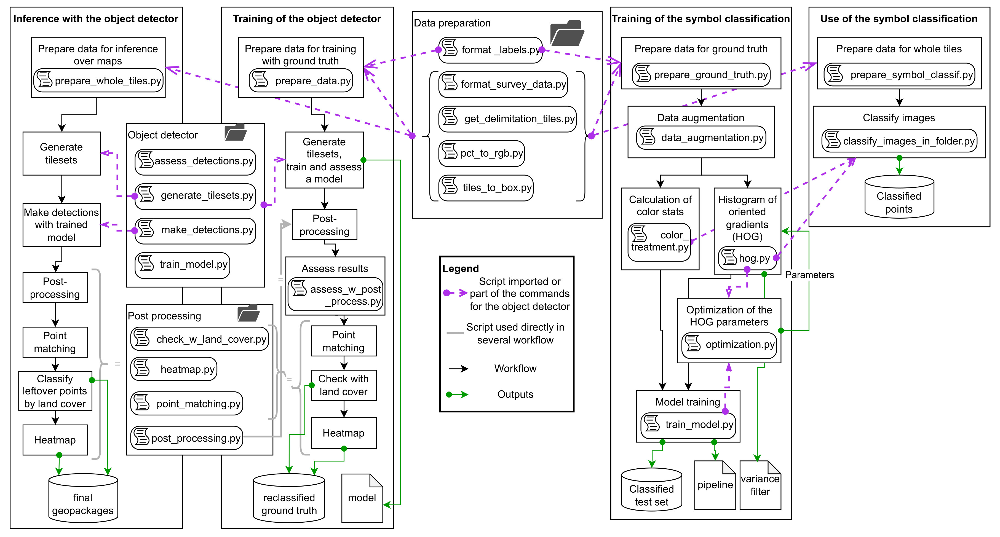

# Classification of the border points based on the cadastral plans of the canton of Fribourg.

This project aims to classify missing border points on old cadastral plans in the digitized version of the official cadastral survey.

*Context*: In some municipalities of Fribourg, the official cadastral survey to the MO93 standard has not yet been implemented in the land register. In these cases, border points are not always represented in the official cadastral survey dataset. This leads to numerous errors when automatically checking the data consistency and makes it more difficult for users to understand the data. <br>
These missing border points can be identified on old plans, but their digitization represents a considerable amount of work. Therefore, we developed this algorithm to automatically classify these points.

Two methods were tested:

* Instance segmentation with the STDL's object detector, and
* Image classification with `scikit-learn` package.

Only the method based on instance segmentation gave satisfactory results for the cadastral survey experts. Therefore, this method is presented in detail here. The second method is briefly described in the [additional information](#additional-information).

The full documentation is available on our technical website: **link**.

**Table of content**

- [Setup](#Setup)
    - [Requirements](#requirements)
    - [Installation](#installation)
- [Data](#data)
- [General workflow](#general-workflow)
- [Additional information](#additional-information)
    - [Project structure](#project-structure)
    - [Symbol classification](#symbol-classification)


## Setup

### Requirements

The historical plans can be large files. In our case, 32 GB of RAM were required to transform the color of the image from color map to RGB space. The rest of the process was performed on a machine with 16 GB of RAM and a nvidia L4 GPU.

The STDL's object detector can only run on *Linux* machines, as it is based on detectron2. To avoid installation conflicts, we recommend running the process in a Docker container. The steps necessary to the creation of the Docker image are described in the next section.

### Installation

The installation is performed from this folder with the following steps:

* Clone the [STDL's object detector](https://github.com/swiss-territorial-data-lab/object-detector),
* Get into the `object-detector` folder,
* The dockerfile of this project supposes the existence on the machine of an image called `object-detector-stdl-objdet`. 
    * You can control the image existence by listing the available images with `docker images ls`.
    * If it is not available, build it from the folder of the object detector with `docker compose build`.
    * You can control the installation by running `docker compose run --rm stdl-objdet stdl-objdet -h`.
* Go back to the folder `proj-borderpoints`,
* Build docker,
* Run docker,
* Go to `proj-borderpoints` directory in docker.


The corresponding command lines are

```
git clone https://github.com/swiss-territorial-data-lab/object-detector.git
cd object-detector
git checkout gs/code_improvement
cd -
docker compose build
docker compose run --rm borderpoints
cd proj-borderpoints            # Command to run in the docker bash
```

**All workflow commands are supposed to be launched in Docker from the `proj-borderpoints` directory.**


## Data

<!-- I will develop this section when we finalize the repo with some example data. For now, it's just key points. -->

* Plans: RGB images or images with a color map in EPSG:2056.
* Cadastral survey data: vector layer with the approximate position of cadastral points used to limit the production of tiles in the area of interest.

When working with the ground truth, the following files are required in addition:

* Bounding boxes: vector layer of the areas were all the cadastral points were digitized.
* Ground truth (GT): vector layer with the delineation and class of all the cadastral points in the bounding boxes.
* Plan scales: Excel file with the number and scale of each plan used for the GT.


## General workflow

The workflow is divided into three parts:

* Data preparation: call the appropriate preprocessing script, *i.e.* `prepare_ground_truth.py` to work with ground truth produced on defined bounding boxes and `prepare_entire_plans.py` to work with entire plans. More precisely, the following steps are performed:
    - Transform the plans from a color map to RGB images,
    - If ground truth is available, format the labels according to the requirements of the STDL object detector and clip the plans to the bounding box of the ground truth,
    - Generate a vector layer with the information of the subtiles dividing the plans into square tiles of 512 or 256 pixels,
    - Clip the plan to the subtiles.
* Detection of the border points with the STDL's object detector: the necessary documentation is available in the [associated GitHub repository](https://github.com/swiss-territorial-data-lab/object-detector)
* Post-processing: produce one file with all the detections formatted according to the expert requirements.
    - `post_processing.py`: the detections are filtered by their confidence score and ...
    - `point_matching.py`: the detections are matched with the points of the cadastral surveying for areas where it is not fully updated yet,
    - `check_w_land_cover.py`: use the data on land cover to assign the class "non-materialized point" to undetermined points in building and stagnant waters.
    - `heatmap.py`: highlight areas with a high concentration of false positive points.

All the parameters are passed through a configuration file. Some fixed parameters are set for the whole process in `constants.py`.

**Training with GT**

```
python scripts/instance_segmentation/prepare_ground_truth.py config/config_w_gt.yaml
stdl-objdet generate_tilesets config/config_w_gt.yaml
stdl-objdet train_model config/config_w_gt.yaml
stdl-objdet make_detections config/config_w_gt.yaml
stdl-objdet assess_detections config/config_w_gt.yaml
```

The post-processing can be performed and the detections assessed again with the following commands:

```
python scripts/post_processing/post_processing.py config/config_w_gt.yaml
python scripts/instance_segmentation/assess_w_post_process.py config/config_w_gt.yaml
```

In the configuration file, the parameters `keep_datasets` must be set to `True` to preserve the split of the training, validation and test datasets.

Performing the point matching is possible with the ground truth.

```
python scripts/post_processing/point_matching.py config/config_w_gt.yaml
python scripts/post_processing/check_w_land_cover.py config/config_w_gt.yaml
python scripts/instance_segmentation/assess_point_classif.py config/config_w_gt.yaml
```

**Inference on entire plans**

```
python scripts/instance_segmentation/prepare_entire_plans.py config/config_entire_plans.yaml
stdl-objdet generate_tilesets config/config_entire_plans.yaml
stdl-objdet make_detections config/config_entire_plans.yaml
python scripts/post_processing/post_processing.py config/config_entire_plans.yaml
python scripts/post_processing/point_matching.py config/config_entire_plans.yaml
python scripts/post_processing/check_w_land_cover.py config/config_entire_plans.yaml
python scripts/post_processing/heatmap.py config/config_entire_plans.yaml
```

## Additional information

### Project structure

The project is constituted of the following folders:

``` 
.
├── config            # Configuration files
├── data              # Input data
└── scripts           # Scripts
    ├── data_preparation        # Scripts for data preparation
    ├── functions               # Functions
    ├── instance_segmentation   # Scripts for instance segmentation
    ├── post_processing         # Scripts for post-processing after the instance segmentation
    ├── sandbox                 # Test scripts not included in workflows
    └── symbol_recognition      # Scripts for symbol classification
```

The figure below shows the different available workflows and the scripts involved in them (click on it to see it larger).




### Symbol classification

#### Requirements

For this workflow, like for the instance segmentation, 32 GB of RAM were needed to transform the color of the image from color map to RGB space. <br>
However, the rest of the process does not require a GPU. It was tested on a Windows 10 machine with python 3.12.

The required libraries can be installed from the file `requirements_classif.txt`.

```
pip install -r requirements_classif.txt
```

#### Workflow

This workflow trains an algorithm to classify images with a border point.

* Data preparation: call of the appropriate preprocessing script, _i.e._ `prepare_ground_truth.py` to work with ground truth produced over defined bounding boxes and `prepare_symbol_classif.py` to work with entire plans. More precisely, the following steps are performed:
    1. Transform the plans from a color map to RGB images,
    2. Determine the symbol size at each plan scale based on the ground truth,
    3. Generate a vector layer with the plan information and delineation,
    4. Join survey points to plans and create a unique id based on point and plan,
    5. Clip the plan to the survey points based on the symbol size determined from step ii.
* (*facultative*) Data augmentation: double the number of training images by flipping them and changing slightly the colorimetry with the script `data_augmentation.py`.
* Feature extraction:
    - `color_treatment.py`: Create a mask indicating the symbol area on the image,	calculate the zonal statistics on each color band for the determined areas,
    - `hog.py`: calculate the Histogram of Oriented Gradients (HOG) features for each symbol image.
* Training and assessment: train and assess the model with the balanced accuracy and classification report generated with `scikit-learn`. Two methods are available.
    - `train_model.py`: train a model with the color and HOG features to classify the symbol images,
    - `train_separate_models.py`: train separate models on color and HOG features to classify the color and shape, then merge the results.
* Classify all images in a folder: get the features and classify all images in a folder. Two methods are available.
    - `classify_images_in_folder.py`: use the model trained on color and HOG features,
    - `classify_color_and_shape.py`: use the color model and the shape model.

All the parameters are passed through a configuration file. Some fixed parameters are set for the whole process in `constants.py`.

The optimization for the classification was performed with the `optuna` package in the dedicated script `optimization.py`.

Below, the command lines are presented for the algorithm version with a single model for the classification.

**Training with GT**

```
python scripts/symbol_recognition/prepare_ground_truth.py config/config_symbol_classif.yaml
python scripts/symbol_recognition/data_augmentation.py config/config_symbol_classif.yaml
python scripts/symbol_recognition/hog.py config/config_symbol_classif.yaml
python scripts/symbol_recognition/color_treatment.py config/config_symbol_classif.yaml
python scripts/symbol_recognition/train_model.py config/config_symbol_classif.yaml
```

**Classification of border points on entire plans**

```
python scripts/symbol_recognition/prepare_symbol_classif.py config/config_symbol_classif.yaml
python scripts/symbol_recognition/classify_images_in_folder.py config/config_symbol_classif.yaml
```